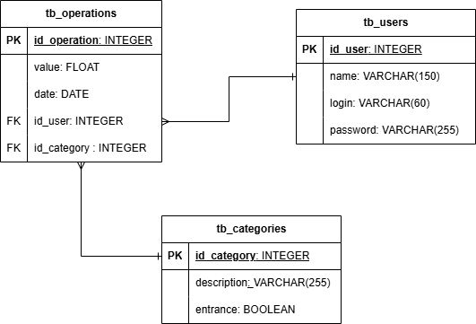

# 🏦 ClearCash

## 📖 Descrição do Projeto

ClearCash é um aplicativo de finanças que visa facilitar o gerenciamento de receitas e despesas. Com uma interface amigável e intuitiva, o ClearCash permite que os usuários registrem suas operações financeiras, classifiquem suas despesas em categorias e gerenciem informações de usuários de forma eficiente. O objetivo é proporcionar uma experiência simples e clara para que qualquer pessoa possa controlar suas finanças de maneira eficaz.

## 🎯 Público-Alvo

O público-alvo do ClearCash inclui:

- **Estudantes**: Aqueles que desejam gerenciar seus gastos mensais e aprender sobre finanças pessoais.
- **Profissionais**: Indivíduos que buscam uma ferramenta prática para controlar receitas e despesas no dia a dia.
- **Pequenos Empreendedores**: Pessoas que precisam acompanhar suas finanças de forma organizada para garantir a saúde financeira de seus negócios.
- **Famílias**: Para aquelas que desejam monitorar suas finanças e planejar o orçamento familiar.

## 🛠️ Tecnologias Utilizadas

- **Front-end**: [React](https://reactjs.org/) 
- **Back-end**: [PHP](https://www.php.net/) 
- **Banco de Dados**: [PostgreSQL](https://www.postgresql.org/) 

## 🚀 Funcionalidades

O projeto inclui três principais funcionalidades, cada uma representando um CRUD (Create, Read, Update, Delete):

### 1. 👤 Usuários

#### Funcionalidade
- **Create**: Registra novos usuários no sistema, armazenando informações como nome e e-mail.
- **Read**: Visualiza a lista de usuários registrados e detalhes de cada usuário individualmente.
- **Update**: Edita as informações do usuário conforme necessário.
- **Delete**: Remove usuários do sistema, eliminando informações desatualizadas ou incorretas.

### 2. 💰 Operações

#### Funcionalidade
- **Create**: Registra novas operações financeiras, incluindo receitas e despesas.
- **Read**: Visualiza uma lista de todas as operações registradas, com filtros para facilitar a busca.
- **Update**: Edita as informações de operações existentes.
- **Delete**: Remove operações financeiras que foram registradas erroneamente.

### 3. 📂 Categorias

#### Funcionalidade
- **Create**: Cria categorias personalizadas para organizar operações financeiras, como “Alimentação” e “Transporte”.
- **Read**: Visualiza todas as categorias existentes, ajudando na organização.
- **Update**: Edita as categorias conforme as necessidades dos usuários.
- **Delete**: Remove categorias que não são mais utilizadas.

#### DER

